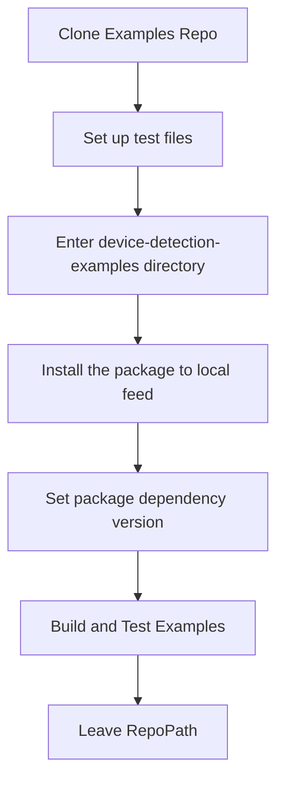

# API Specific CI/CD Approach
This API complies with the `common-ci` approach with the following exceptions:

The following secrets are required:
* `ACCESS_TOKEN` - GitHub [access token](https://docs.github.com/en/authentication/keeping-your-account-and-data-secure/managing-your-personal-access-tokens#about-personal-access-tokens) for cloning repos, creating PRs, etc.
    * Example: `github_pat_l0ng_r4nd0m_s7r1ng`
  
The following secrets are required to run on-premise tests:
* `DEVICE_DETECTION_KEY` - [license key](https://51degrees.com/pricing) for downloading assets (TAC hashes file and TAC CSV data file)
    * Example: `V3RYL0NGR4ND0M57R1NG`
 
The following secrets are requred to run cloud tests:
* `SUPER_RESOURCE_KEY` - [resource key](https://51degrees.com/documentation/4.4/_info__resource_keys.html) for integration tests
    * Example: `R4nd0m-S7r1ng`
* `ACCEPTCH_BROWSER_KEY` - [resource key](https://51degrees.com/documentation/4.4/_info__resource_keys.html) containing accept-ch browser properties for integration tests
    * Example: `R4nd0m-S7r1ng`
* `ACCEPTCH_HARDWARE_KEY` - [resource key](https://51degrees.com/documentation/4.4/_info__resource_keys.html) containing accept-ch hardware properties for integration tests
    * Example: `R4nd0m-S7r1ng`
* `ACCEPTCH_PLATFORM_KEY` - [resource key](https://51degrees.com/documentation/4.4/_info__resource_keys.html) containing accept-ch platform properties for integration tests
    * Example: `R4nd0m-S7r1ng`
* `ACCEPTCH_NONE_KEY` - [resource key](https://51degrees.com/documentation/4.4/_info__resource_keys.html) containing no accept-ch properties for integration tests
    * Example: `R4nd0m-S7r1ng`

The following secrets are required for publishing releases (this should only be needed by 51Degrees):
* `NUGET_API_KEY` - 51Degrees NuGet API key used for publishing
* `CODE_SIGNING_CERT_ALIAS` - Name of the 51Degrees code signing certificate alias
* `CODE_SIGNING_CERT_PASSWORD` - Password for the `CODE_SIGNING_CERT`
* `CODE_SIGNING_CERT` - String containing the 51Degrees code signing certificate in PFX format

* `JAVA_STAGING_SETTINGS_BASE64` - Base64 encoded settings.xml file which points to the Sonatype staging repo.
* `JAVA_GPG_KEY_PASSPHRASE` - Passphrase string for the 51Degrees GPG key used to sign releases
* `JAVA_KEY_PGP_FILE` - String containing the 51Degrees PGP key

The following secrets are optional:
* `DEVICE_DETECTION_URL` - URL for downloading the enterprise TAC hash file
    * Default: `https://distributor.51degrees.com/api/v2/download?LicenseKeys=DEVICE_DETECTION_KEY&Type=HashV41&Download=True&Product=V4TAC`

## Linux PreBuild

.NET does not officially support the x86 architecture on Linux distributions, therefore, we are building the native binaries in the same job as the x64 binaries. 

## Integration Tests

The integration testing approach differs from the 'general' inversion of control approach outlined in the [Design.md](https://github.com/51Degrees/common-ci/blob/gh-refact/design.md) as the it cannot be generic. 

The integration tests are conducted to verify the proper functioning of the device-detection-dotnet-examples with the newly built packages. In order to do this, the integration tests use a locally built and installed version of the device-detection-dotnet dependency created in the preceding stages of the pipeline. 

The necessary secrets such as Resource Keys and location of the test file are set up in the `setup-environment.ps1` script as environmental variables.  

The below chart shows the process of running tests for the device-detection-dotnet-examples. 

It performs the following steps:

1. Clone Examples Repo: Clone the "device-detection-dotnet-examples" repository into the common-ci directory.
2. Set up test files: Move the TAC-HashV41.hash file and evidence files to the device-detection-dotnet-examples/device-detection-data directory.
3. Enter device-detection-examples directory: Changes the current working directory to the device-detection-dotnet-examples folder.
4. Install nuget packages to local feed: publishes the packages locally to the user home directory.
5. Set package dependency version: Sets the version of the device-detection package dependency for the examples to the specified Version parameter. This will be the version installed in the local repository found in the .nuget folder.
6. Build and Test Examples: Builds the project with updated dependency and runs unit tests in the examples project

## Performance Tests

The script sets up the required directories to store the test results and builds the performance tests project using publish command to produce an executable file that is then passed to the script. If the operating system is Linux, it installs the APR library needed for the tests. It then proceeds to build the performance tests using CMake and generates the necessary executable.

From the generated "summary.json" file, relevant data is extracted to create a performance summary in JSON format. This summary includes DetectionsPerSecond and MsPerDetection metrics.
